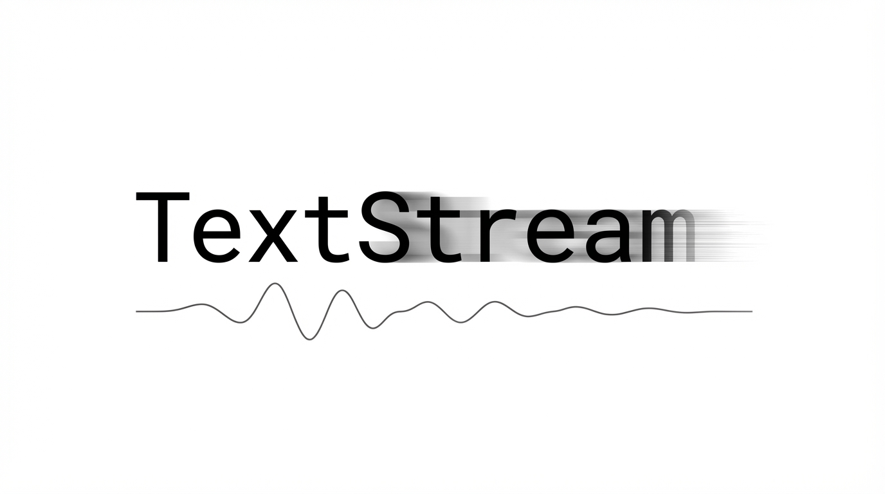

# TextStream

<p align="center">
  
</p>

Live speech-to-text on Apple Silicon. Streams microphone audio through Qwen3-ASR and shows results in a browser — updated every 2.5 seconds with finalized and draft text.

Built for real-time transcription during calls, meetings, or recording sessions. Uses Silero VAD to filter non-speech audio (music, background noise) before it reaches the model, which kills the hallucination problem where ASR models regurgitate their system prompt on noise input.

## What it does

- Captures mic audio at 16kHz, runs Silero voice activity detection, feeds speech chunks to Qwen3-ASR on MLX
- Streams finalized + draft text to a browser UI via SSE at `localhost:7890`
- Saves timestamped transcripts to `~/Documents/textstream/transcripts/YYYY-MM-DD/`
- Optionally pushes Grafana annotations for each finalized text segment
- Two model sizes: 0.6B (default, fast) and 1.7B (more accurate), hot-swappable from the browser

## Install

```bash
pip install textstream-asr
```

Requires Apple Silicon (M1 or later) and Python 3.10+. MLX doesn't run on Intel or Linux.

## Usage

```bash
textstream                            # Qwen3-ASR 0.6B, opens browser
textstream --engine qwen-1.7b         # larger model, lower word error rate
textstream --vad-threshold 0.5        # stricter voice detection (default 0.4)
textstream --interval 2.0             # faster updates
textstream --no-browser --no-grafana  # headless
textstream --port 8080                # custom port
```

The browser UI shows live text with a dark theme. Finalized text in white, draft predictions in grey. Switch models from the dropdown without restarting.

## How it works

Every `--interval` seconds, TextStream drains the mic buffer and runs Silero VAD on the chunk. If speech is detected (probability >= `--vad-threshold`), the chunk is fed to Qwen3-ASR's streaming decoder. The model returns stable (finalized) text and speculative (draft) text. Stable text is persisted to disk and broadcast to all connected browsers via server-sent events.

If the model hallucinates (outputs its chat system prompt on noise that slips past VAD), a pattern filter catches it and resets the stream. This is a safety net — with VAD active, it almost never fires.

Qwen3-ASR handles its own 30-second sliding context window internally, so there's no manual drift reset needed.

## API

```
GET /          → browser UI
GET /stream    → SSE event stream (data: {"type":"stream","finalized":"...","draft":"..."})
GET /engine    → {"engine":"qwen"} or {"engine":"qwen-1.7b"}
GET /switch?engine=qwen-1.7b → hot-swap model
GET /pause     → pause mic capture
GET /resume    → resume mic capture
GET /stop      → shutdown server
```

## Configuration

| Flag | Default | Description |
|------|---------|-------------|
| `--port` | 7890 | HTTP server port |
| `--engine` | qwen | `qwen` (0.6B) or `qwen-1.7b` |
| `--interval` | 2.5 | Seconds between transcription updates |
| `--vad-threshold` | 0.4 | Silero VAD speech probability threshold |
| `--no-browser` | false | Don't open browser on start |
| `--no-grafana` | false | Disable Grafana annotation push |

Grafana integration reads `GRAFANA_URL` and `GRAFANA_SERVICE_ACCOUNT_TOKEN` from environment variables. If the token is empty, Grafana push is skipped automatically.

## Dependencies

- [MLX](https://github.com/ml-explore/mlx) — Apple Silicon ML framework
- [mlx-qwen3-asr](https://github.com/niclas3640/mlx-qwen3-asr) — Qwen3-ASR for MLX
- [silero-vad-lite](https://github.com/snakers4/silero-vad-lite) — Voice activity detection (~2MB, bundles ONNX runtime)
- [sounddevice](https://python-sounddevice.readthedocs.io/) — PortAudio bindings for mic capture
- NumPy

## Author

Boris Djordjevic — [199 Biotechnologies](https://github.com/199-biotechnologies)

## License

MIT
